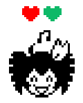

## howdy

rva.rip was a project I made when I was at a very lonely time in my life. Through it I was able to find a ton of friends and awesome connections I'd never had before, by trying to make exactly the kind of resource I needed to help people connect with their communities and attend tons of awesome things for free, I became *the guy* who attended awesome things for free and made a ton of friends. Fucking sick.

However, if you've used rva.rip in the first three quarters of 2026, you can see it's in a sorry state.

I took a backseat from development because of some personal matters but also because I helped to start the local branch of the [Party for Socialism & Liberation](https://pslvirginia.org/).

This was an awesome experience, but also a very draining one. The [United States](https://liberationschool.org/is-the-united-states-one-nation/) and the [nations trapped within it](https://liberationschool.org/harry-haywoods-contributions-to-the-national-question-and-the-fight-for-class-unity/) absolutely need a [socialist party](https://vincentbevins.com/book2/) by any means necessary, and I stand by that, but I've gone through some personal matters that have seriously affected my life and I've needed to (unfortunately) take a step back.

With all that said, I'm trying to step back into the things that I feel made myself, me. And one of those things was making this website.

## ripcale

Ripcale is a new framework I'm developing that extends the legacy created by bay.lgbt, rva.rip, dmv-diy.fyi (huge inspo!!!), and other projects that consider bay.lgbt and rva.rip their heritage.

It will involve a distinct backend and frontend, with moderation via a telegram bot as the backend (but maybe I should make it platform agnostic at first... hm...)

### Why ripcale

I want to start a new framework because there's a lot of issues that have piled up with the legacy code of rva.rip over time. For one, practically every single dependency is out of date in an absolutely tiring mess of metaphysical wires. Even just getting it back up and running seemed like a fight against god.

Further, a large part of the philosophy was creating an alternative for instagram. When getting involved with the party I made an instagram to keep up with things for the first time, but over time I realized it was sucking me in. The fears I'd had about instagram were actually real!!! That sucked. 

However, instagram is so popular because it feels collectively owned. Collective ownership over rva.rip is, I think, the key to make it feel like something that people really really keep coming back to. In order to make an alternative, I need a place where people can keep going back, and it keeps people on the page (think modals instead of newpages). 

This requires new features like user submission, and better tools for constant moderation in case I take a step back. Structural issues with the rva.rip code, inherited from bay.lgbt, made it implicitly my own walled garden over-reliant on google calendar; with no real great way to hide sources if for example a person didn't want all their junk being leaked! No offense @bytewife, your code is great and younger me really appreciated it, but the entire stack was hosted on vercel as a combined frontend and backend. Unfortunately she's bound for error with such a monolithic design, despite it being a good starting point at the time.

In order to support user submissions, and also have a good place to cache instagram posts in order to have an initial place to populate the page, it became necessary to just make a backend. I've been [selfhosting](https://redlib.catsarch.com/r/selfhosted) for a long time, and I feel confident in that I can host a docker container on a public server that a sexier frontend can connect to and work with. Separating the frontend and backend means I can actually use a database, and treat that as the single source of truth rather than a re-generated source of truth every 15 minutes.

## Things I want to do different

 - UI Refresh for the frontend, still utilizing FullCalendar and Modals, but instead with a unified UI approach instead of the one that lead to the ugly ass filter design I had
   - Take design cues from rva.lol generally, that guy's a fucking genius
   - Finally implement [mutant standard emotes](https://mutant.tech/) like I've always wanted to
 - Keep people engaged even not on the site
   - Telegram channel that auto-populates events on a semi-regular basis? 
   - RSS feed?
   - Whatsapp channel?
   - ics subscribing
   - Instagram's able to keep people on the platform partially because it's just an easy place to go to that also sends you annoying as f notifications. I don't want to be annoying, but even if a person doesn't actively open up rva.rip every morning I want them to have the option to stay in touch. Being able to subscribe via ics so that you can always seee the latest, or using some kind of bot channel like Telegram or Whatsapp or others that people are used to would be dope. Are there other options that normal people use? Signal doesn't allow bots or else I would absolutely love to have it on there.
 - More robust backend
   - Performant
   - Grab from instagram regularly
 - User submissions, actually!!!!!!!!!!!
   - The previous user submissions system fucking sucked ass. I had to add them manually, it worked at first but as I got tired or didn't respond to people on time it got worse. Fucking ass
   - Initially each has to be sent and approved by hand via an EASY TO USE MODERATION TOOL THAT DOESN'T REQUIRE ME BEING AT MY COMPUTER; but over time build into a system where trusted people can submit using a dedicated interface or their calendar solution of choice without approval (but if they break trust so help me god)
 - Support the transition from insta to rva.rip
   - Start by populating the page largely with instagram pages I like
   - Implement a feature where items which have been specifically submitted to rva.rip are highlighted wayyyy more than instagram events. Keep this highlighting process just for events submitted, not introduce a ton of visual noise or else the highlighting loses it's meaning. Make it so that even if a person doesn't understand the distinction, they're innately pulled to those events, upping the prestige of those who submit and helping them feel
 - Better filtering that isn't ugly and a waste of time imho
   - We had some events that had their own filter. Ass. The filter system fucking sucked. rva.lol does it right, we should have a very limited set of event types with...
 - Badges
   - Holy fuck I made too many badges. Holy fuck. I mean it was fun and looks iconic but god damn is it a lot of visual baggage and complication. 
   - Instead of badges being for everything, we should just utilize the colored dots provided by FullCalendar (or some other very small and simple design) with a unique color for each kind of event. Blue being markets, purple being shows, red being socialism, pink being movies, etc etc idk idk.
 - Better national representation
   - I'm a white trans woman, but being trans doesn't erase the white. There's lots of national experiences inside the United States that I'm not familiar with, and ethnic and cultural niches and diversity which I have no experience in. We're linked by the struggle against capitalism, which makes our lives worse and seeks to divide us. Queerness, like being of an ethnic or national minority background, is a special oppression which leads to unique social and political circumstances. Those of us with special oppressions need to stick together and support each other; and rva.rip ought to be a place where people experiencing these effects can all gather. 
   - Having been studying Chinese for a while, it's hard to find out about matters like language learning and cultural enrichment without specifically knowing people. What if someone of a given heritage is new to the city and wants to connect with their community? rva.rip can be a stop for that again, but this needs to be something specifically cultivated.
 - New stickers and a mascot
   - I WANT A MASCOT! Mascots are cute and mascots are cute and mascots are cute
   - I want something recognizable that someone can look at and go like "Oh yeah, I recognize that, I trust that". I want to establish trust and like design commonalities that lead to a built in sense of trust, and a mascot to be the face of that if I can.
   - 
     - I love Kasane Teto, she is just like me for real. Maybe a Richmond teto? But I want to make sure it's inclusive of people in Richmond and not just of my background...
   - I floated the Richmond Vampire. That would be cool, lots of people know her
   - I also absolutely loved making stickers. I had a previous sticker design that to me was very iconic, I would see it up all over the place. It was something that I was also able to make posters of, there's still an rva.rip poster up inside Studio Two Three as of me writing this!
   - I love stickers and I want to make more and I want to put them all over the city
   - Maybe wheatpaste too but don't tell anybody because that might be illegal idk if somebody does it it wasn't me
 - Easier to deploy
   - Okay, look, rva.rip wasn't that hard to deploy. But it was hard to maintain and also keep in touch with the features being made and deployed on rva.rip
   - Not to mention a ton of undocumented behavior that I made for specific use cases and never really wrote down about, like every filter feature every
   - Butttt having a new stack means I can make a straightforward guide on how to deploy this new framework, annddd separate the frontend config from the backend raw info. I can make it easier for the backend to function and be moderated for people using the debug interface.
 - Last forever, baby
   - rva.rip fell apart when I didn't run it actively, I mean it ran well and was still used by people for a long time, but it inarguably became stale.
   - We're fighting off staleness for as long as we can!!!!!!!!
   - rva.rip can't just be a "oh it's run by somebody somewhere idk but I use it" kind of thing. I want it to be something that people feel real ownership over so that they contribute to it in either representation, exposure, contributing events, code, and other matters I can't predict rn. I want it to be more than me! Selfishly I like being the one who made something, but I want it to be more than me!!!!!!
   - So I need to figure out how to do that...

## p.s.

I just want to thank everybody who's reached out and texted me. rva.rip has been in a dire state for a long time, so, I figured nobody was using it. Lo and behold I saw an instagram story post about someone being sad it was broken. I was shocked anyone still used it; and it lead me down the rabbithole of there actually being a lot of people who still use it. That's fucking sickkkkkk. 

So thank you to everyone who kept using it. And also those of you who joined my updates channel, mwah, y'all are the sweetest. And you, the girl reading this. You read all my rambling, sleep deprived thoughts. So thanks.

I also want to thank some of the people who kept contributing events long after I stopped giving this project the time and energy it deserved. Especially Archer, you're the goat.

Finally I want to thank the author of rva.lol; your project is sick and seeing it on my instagram made me a little jealous. I wanted to make something as cool as what you're doing, but for areas that rva.lol didn't focus on. It remains an awesome resource for finding shows in the area, holy cow, I want to meet you one day.

Also Jamie Paige you're fucking sick and you reminded me [how cool it is to be transgender](https://www.youtube.com/watch?v=0iVlSNpq8i8&).

Thanks for reading (˶˃ ᵕ ˂˶) .ᐟ.ᐟ

🩵
🩷
🤍
🩷
🩵
||
🔴
🟠
🟡
🟢
🔵
🟣
||
🇵🇸
🚩